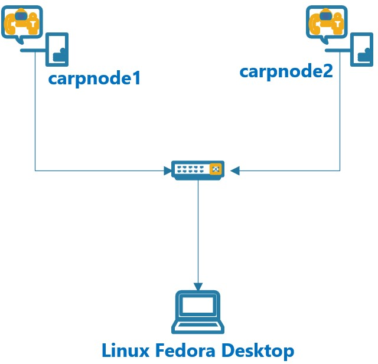
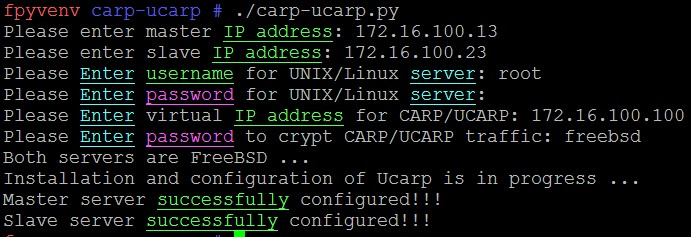
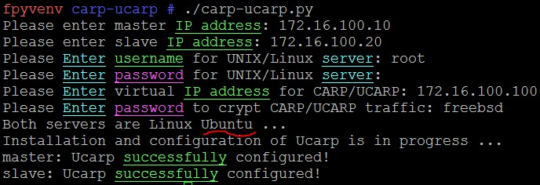
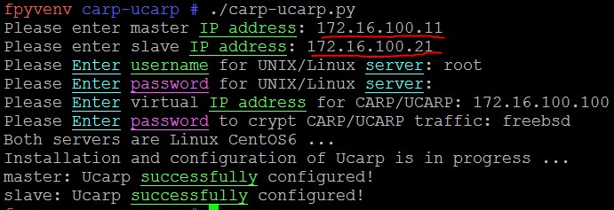
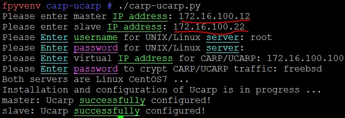
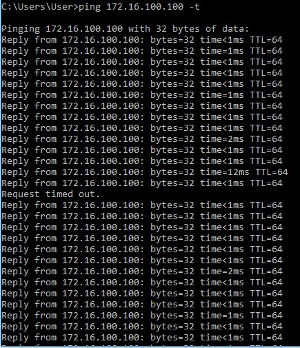
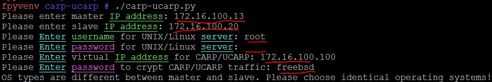
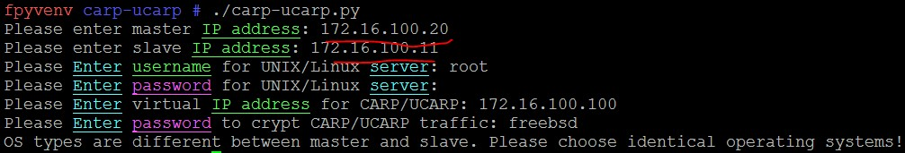
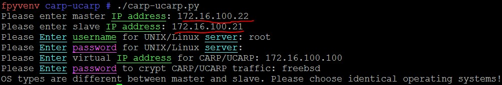

******************************************************
CARP/UCARP install and configure to UNIX/Linux servers
******************************************************

This article describes the python script which automatically installs and configures `CARP <https://en.wikipedia.org/wiki/Common_Address_Redundancy_Protocol>`_ for UNIX (**FreeBSD**) and `UCARP <http://wiki.greentual.com/index.php/Ucarp>`_ for Linux (**Ubuntu**, **CentOS6** or **CentOS7**) servers. The script requires an **IP address**, **login**, **password**, **virtual IP** and **CARP password** as input parameters. Determination of the type of operating system is performed automatically.

* The test environment consists of ``Ubuntu``, ``CentOS6``, ``CentOS7``, ``FreeBSD`` servers in which the **CARP/UCARP** will be configured. Each type of OS has **2** machines::

    Ubuntu          CentOS6         CentOS7         FreeBSD
    172.16.100.10   172.16.100.11   172.16.100.12   172.16.100.13
    172.16.100.20   172.16.100.21   172.16.100.22   172.16.100.23
    
    VIP: 172.16.100.100

Only machines of one type of OS can be configured at a time.

* **Note**: The python script uses ``fabric`` library which requires **BASH** to be installed on all FreeBSD machines. Please use the following commands::

    # pkg install -y bash
    # echo "fdesc /dev/fd  fdescfs  rw  0  0" >> /etc/fstab ; mount -a
    # chsh -s bash root ; cp /usr/local/bin/bash /bin/

Execute script to configure servers. 

* FreeBSD:

* Ubuntu:

* CentOS6:

* CentOS7:

You can test the system by shutting down the master node while pinging the VIP. Only one ping should be lost.

If you try to use different types of operation systems for master and slave nodes, you will get the following notification and script will not perform the installation.

* Try with FreeBSD and Ubuntu servers:

* Try with Ubuntu and CentOS6 server:

* Try with CentOS6 and CentOS7 server:

* Use the following commands to download and execute code files::
  
    # git clone https://github.com/jamalshahverdiev/carp-ucarp-unix-linux.git
    # cd carp-ucarp-unix-linux
    # ./carp-ucarp.py
